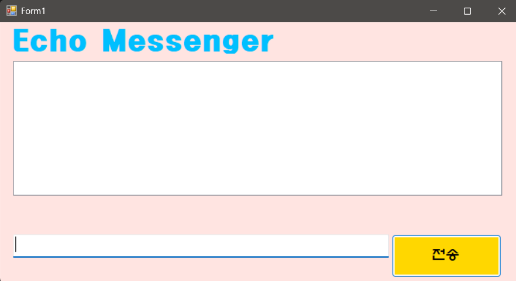
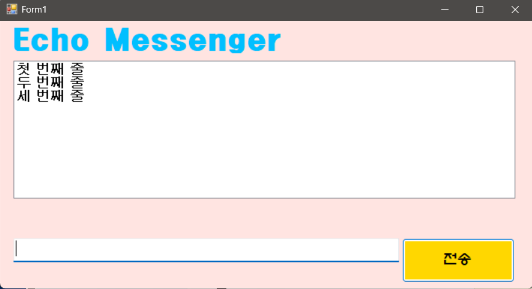
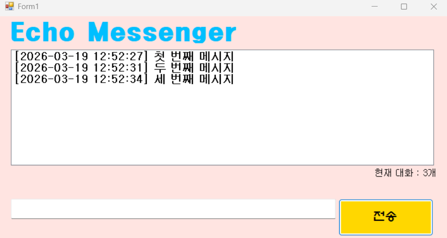
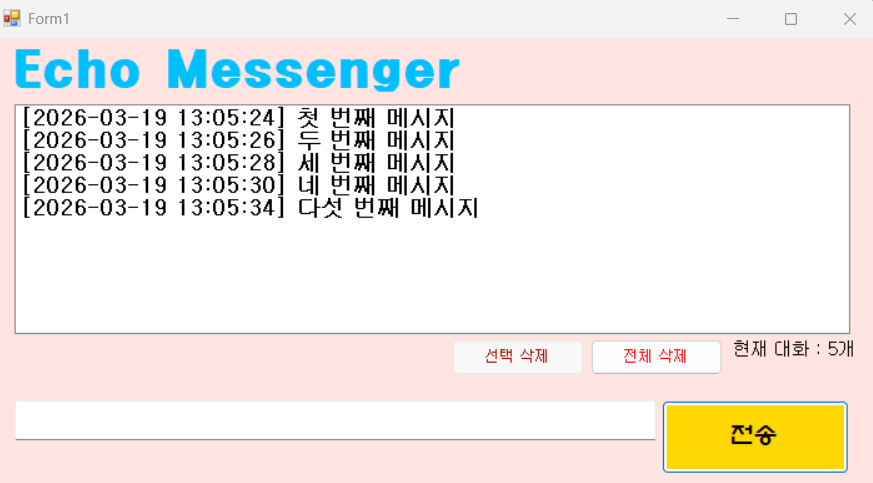
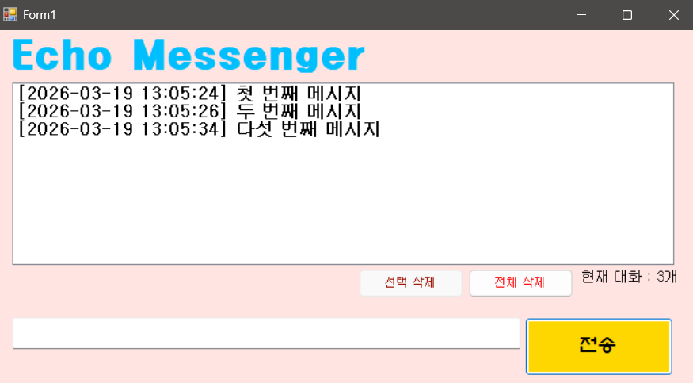
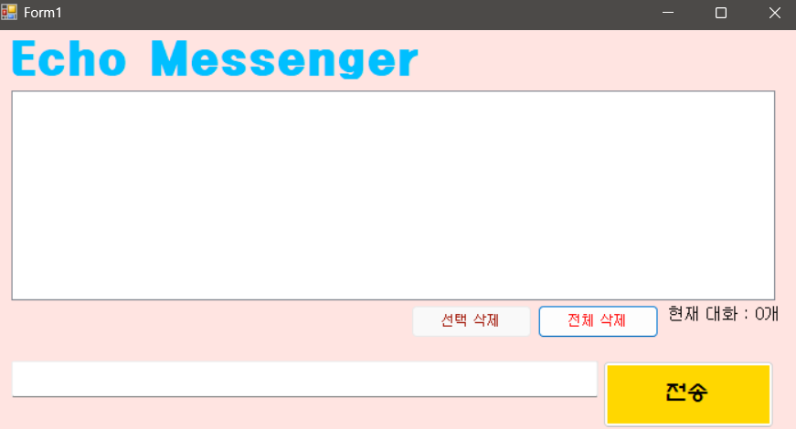
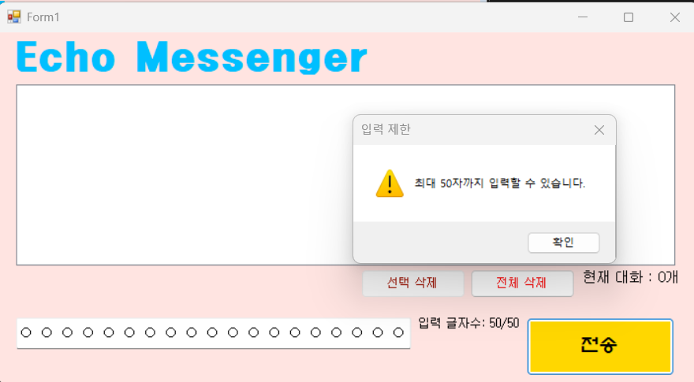

# (C# 코딩) 에코 메신저

## 개요
- C# 프로그래밍 학습
- 1줄 소개 : 사용자 키보드 입력을 받아서 화면에 출력해주는 프로그램
- 사용한 플랫폼 : C#, .NET Windows Forms, Visual studio, Github
- 사용한 컨트롤: Label, TextBox, Button, ListBox
- 사용한 기술과 구현한 기능 :
  - UI 디자인 : Windows Forms를 사용하여 간단한 사용자 인터페이스 구성
  - 데이터 바인딩 : ListBox에 사용자 입력을 추가하여 실시간으로 업데이트
  - DateTime 클래스를 이용한 현재시간 정보 구하기
  - 메시지를 입력받고 전송버튼을 누르면 리스트박스에 메시지가 추가되는 기능
  - 메시지 입력 후 엔터키로도 메시지를 전송할 수 있도록 구현
  - 메시지 전송 시 현재 시간과 함께 메시지를 리스트박스에 표시하는 기능
  - 메시지 입력창이 빈 문자열이거나 공백으로만 이루어진 경우 메시지를 전송하지 않도록 예외 처리
  - 리스트에 쌓인 총 메시지 개수를 표시하는 기능
  - 입력한 메시지 앞 뒤 불필요한 공백을 제거하여 저장하는 기능
  - 리스트박스에서 특정한 메시지를 삭제할 수 있는 기능
  - 전체 대화기록을 삭제할 수 있는 기능
  - 입력창에 글자 수를 50자로 제한하고, 초과 시 경고 메시지를 표시하는 기능

## 실행화면 (과제1)
- 1단계 코드의 실행 스크린샷
- 
- 과제 내용
  - Label(표시), TextBox(입력), Button(전송), ListBox(대화창)를적절히배치합니다.
  - 전송버튼클릭시TextBox의텍스트를ListBox의항목(Items)으로추가합니다.
  - 추가직후TextBox의내용을비워(Clear) 다음입력을준비합니다.

- 구현 내용과 기능 설명
  - 입력창에 메시지 입력하고 전송 버튼을 누르면 메시지가 리스트 박스에 표시
  - 계속 반복하면 메시지가 리스트 박스에 한 줄씩 계속 추가

## 실행화면 (과제2)
- 2단계 코드의 실행 스크린샷
- 
- 과제 내용
  - 전송이 끝나면 입력창에 남겨진 기존 메시지를 삭제합니다
  - 전송 후에 마우스로 입력창을 다시 클릭하지 않아도 되도록 커서를 자동으로 입력창에 둡니다.
  - 마우스 클릭 대신 키보드의 Enter키로도 메시지를 전송할 수 있도록 합니다.
  - 내용이 없는 빈 문자열이나 공백만 있을 때는 메시지가 전송되지 않도록 방지합니다.

- 구현 내용과 기능 설명
  - 메시지 입력 후 엔터키로도 메시지를 전송할 수 있도록 구현
  - 메시지 전송 후 자동으로 입력창을 비우고 커서를 입력창에 위치시키도록 구현
  - 메시지 입력창이 빈 문자열이거나 공백으로만 이루어진 경우 메시지를 전송하지 않도록 예외 처리

## 실행화면 (과제3)
- 3단계 코드의 실행 스크린샷
- 
- 과제 내용
  - 메시지 앞에 현재 시간을 자동으로 결합하여 리스트에 출력합니다.
  - 현재 리스트에 쌓인 총 메시지 개수를 계산하여 하단 Label에 실시간으로 업데이트합니다.
  - 사용자가 입력한 메시지의 앞뒤 불필요한 공백을 Trim() 메서드를 사용하여 제거한 후 리스트에 저장합니다.

- 구현 내용과 기능 설명
  - DateTime 클래스를 이용한 현재시간 정보 구한 후 메시지와 함께 리스트박스에 표시
  - 리스트박스에 쌓인 총 메시지 개수를 Count하여 아래 Label에 표시
  - 텍스트박스에 사용자가 입력한 내용을 Trim() 메서드를 사용하여 앞뒤 불필요한 공백 제거한 후 리스트박스에 저장 

## 실행화면 (과제4)
- 4단계 코드의 실행 스크린샷
- 
 - 선택삭제 한 후 실행화면 
 - 전체삭제 한 후 실행화면 
 - 50자 입력제한이 걸린 화면 
- 과제 내용
  - 리스트박스에서 특정한 메시지를 마우스로 클릭하고 '삭제' 버튼을 누르면 해당 항목만 목록에서 제거합니다.
  - '전체 삭제' 버튼을 클릭하면 리스트의 모든 내용을 한 번에 지웁니다.
  - 입력창에 글자 수를 50자로 제한하고, 초과 시 경고 메시지를 표시하고 전송을 차단합니다.

- 구현 내용과 기능 설명
  - 리스트박스에서 특정한 메시지를 마우스로 클릭하고 '선택 삭제' 버튼을 누르면 해당 항목만 목록에서 제거하는 기능 구현
  - 메시지를 선택하지 않았다면 '선택 삭제' 버튼을 비활성화 하여 예외 처리
  - '전체 삭제' 버튼을 클릭하면 리스트의 모든 내용을 한 번에 지우는 기능 구현
  - 리스트 박스내에 메시지 개수 변화가 있을 때마다 총 메시지 개수를 업데이트 하도록 구현
  - 입력창에 글자 수를 옆 Label에 표시
  - 입력가능한 글자수를 50자로 제한하고, 초과 시 경고 메시지를 표시하고 전송을 차단하는 기능 구현 

## 배운 내용
- IntelliSense 기능을 활용하여 C# 언어의 다양한 메서드와 속성을 쉽게 사용할 수 있었습니다.
- 다양한 문자열 메소드를 이용하여 사용자 입력을 처리하고, 메시지 포맷팅을 할 수 있었습니다.
- DateTime 클래스를 활용하여 현재 시간을 구하고, 메시지와 함께 표시하는 방법을 배웠습니다.
- 리스트박스 메서드를 사용하여 동적으로 항목을 추가, 삭제하는 방법을 익혔습니다.
- 선택삭제 기능을 구현하면서 선택하지 않고 삭제 시 해야하는 예외처리에서 어려움을 느꼈었지만 Copilot의 도움을 활용하여 메시지가 선택되지 않았을때 버튼을 비활성화 함으로써 예외처리를 할 수 있었습니다.
	

